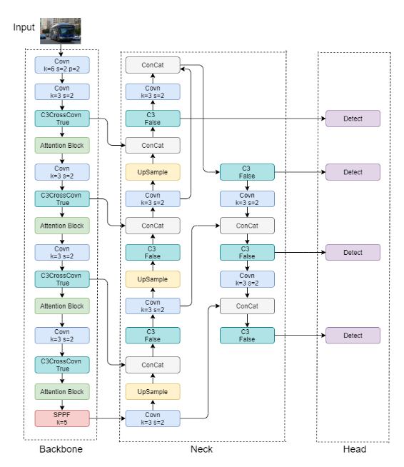

代码重构了一下，把ultralytics放了进来方便直接改源码，后面慢慢把不需要的部分删掉再传到github

好不容易看了个论文想抄抄创新点，结果他竟然数据造假，yolov5m和v5-res的参数量正好相反

记录一下今天跑的模型结果

epochs均为200，数据集均为VisDrone2019

|Model         |Parameters|GFLOPs|Early Stopping|Train Epochs|mAP@50:95| mAP50 |
|:---:         |:---:     |:---: |:---:         |:---:       |:---:    |:---:  |
|yolov8m-cbam  |49431668  |193.8 |168           |118         |0.24842  |0.41506|
|yolov8m       |25902640  |79.3  |174           |124         |0.25743  |0.42222|
|yolov8m-sod   |10862900  |38.1  |None          |None        |0.24436  |0.40563|
|yolov5m       |25111456  |64.6  |200           |150         |0.25189  |0.41390|
|yolov5m-resnet|42333358  |106.8 |None          |None        |None     |None   |

有些数据没记录下来，得重新跑一遍

啥提升都没有啊。。。

本来还想着用SODA-A跑个检测，结果他是旋转框